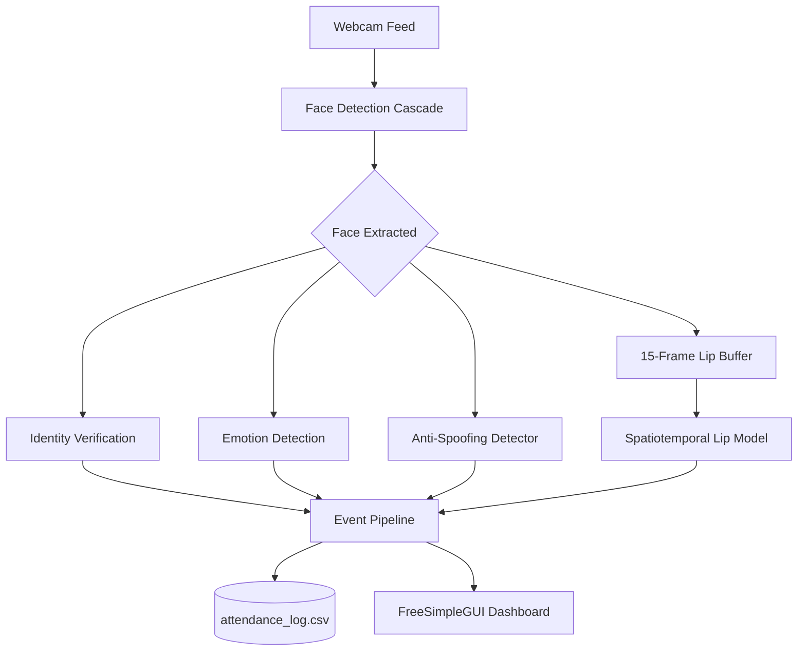
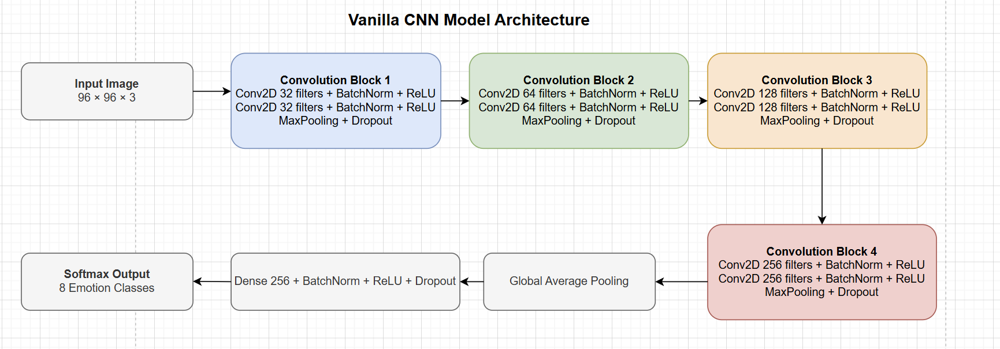
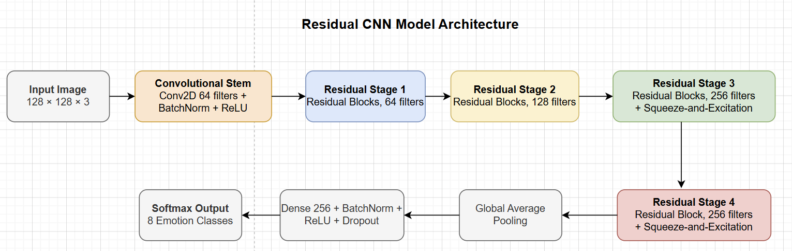
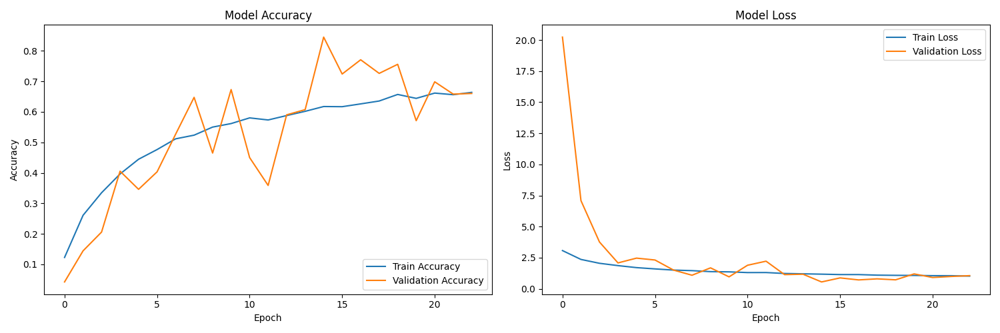
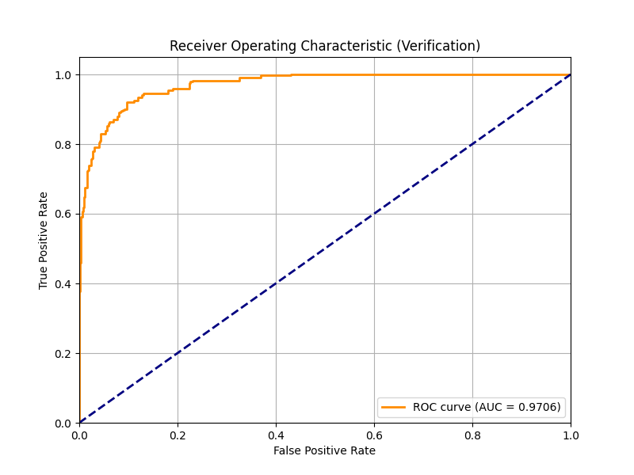
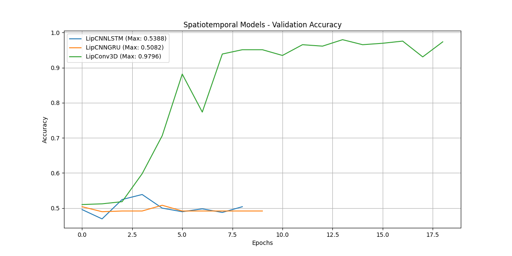

# COS30082-Applied Machine Learning - Facial Recognition with Emotion and Liveness

## System Architecture

The following diagram illustrates the real-time inference pipeline of the application:



## Instructions

To get a local copy up and running, follow these simple steps.

### Prerequisites

* Python 3.8+
* Laptop webcam

### Installation & Setup

1.  **Clone the repository:**
    ```sh
    git clone https://github.com/your_username/COS30082_Facial_Recognition_with_Emotion_and_Liveness.git
    cd COS30082_Facial_Recognition_with_Emotion_and_Liveness
    ```

2.  **Create and activate a virtual environment:**
    * **Windows (PowerShell):**
        ```powershell
        python -m venv .venv
        .\.venv\Scripts\activate
        ```

3.  **Install the required packages:**
    ```sh
    pip install -r requirements.txt
    ```

4.  **Download Required External Datasets:**
    For the training scripts to function, you must manually download the following datasets via Kaggle and place them in the `data/` folder:
    * **AffectNet Dataset**: Place the extracted folders in `data/AffectNet/`
    * **Glasses Detection Dataset**: Place the extracted folders in `data/glass_detection/Glasses_dataset/`
    * **RAVDESS Dataset**: Place the extracted folders in `data/RAVDESS/`
    * **Large Crowdcollected Face Anti-Spoofing Dataset**: Place the extracted folders in `data/lfw/`
    * **Labelled Faces in the Wild (LFW) Dataset**: Place the extracted folders in `data/lfw/`

5.  **Run the Dashboard:**
    ```sh
    python src/gui/desktop_app.py
    ```

## Application Features

- **Automated Background Training**: Use the dashboard to dynamically initiate Python subprocesses that train your models in the background. The progress bar updates in real-time by parsing terminal output.
- **Dynamic Model Selection**: Instead of hardcoded paths, use dropdown menus to select and hot-swap active model architectures (e.g. FNN vs MLP) on the fly without restarting the application.
- **Lip-Reading Vocal Thresholding**: Uses sequence difference monitoring across 15 frames to prevent lip-reading models from inferencing during idle periods.
- **Real-Time Event Logging**: Every entrance, exit, spoken phrase, spoof attempt, and detected emotion is time-stamped and recorded automatically to `src/attendance/attendance_log.csv`.

---

## Model Architectures and Findings

### 1. Emotion Detection
The Emotion Detection module was developed using the AffectNet dataset. We explored two primary architectures to balance performance and feature extraction.

#### Vanilla CNN
Developed as a baseline architecture, it uses four convolutional blocks with progressively increasing filters from 32 to 256. It captures low-level visual cues (edges, contours) early and deeper expression-specific patterns later. It utilizes Batch Normalisation and Dropout to reduce overfitting, and replaces large flattening layers with Global Average Pooling.



#### Residual CNN
A deeper alternative designed for more complex facial expressions. The addition of residual blocks with skip connections mitigates information loss. Furthermore, lightweight squeeze-and-excitation blocks recalibrate channel-level feature importance. It was trained using label smoothing, AdamW optimisation, weight decay, and cosine learning-rate decay.



### 2. Identity Verification (MLP vs FNN)
Identity embeddings were evaluated to distinguish unique actors. Below are the learning curves and ROC curves representing the optimal performance threshold of the MLP network.

**MLP Learning Curves:**


**MLP ROC Curve:**


### 3. Spatiotemporal Lip Reading
We evaluated several sequence-modeling networks (CNN-LSTM, CNN-GRU, 3D-CNN) over 15-frame rolling buffers to transcribe spoken sequences. Below is a comparative performance chart of the lip reading architectures.



---

## Troubleshooting

- **`FileNotFoundError: Missing split directory`**: This occurs when attempting to train a model without the corresponding dataset. Ensure you have downloaded the datasets specified in the *Installation & Setup* section and placed them in the exact directory structures required.
- **Models failing to load on startup**: If the dashboard starts but the models fail to load, ensure the `models/checkpoints/` directory contains the required `.h5` or `.keras` weights. If they are missing, you must run the background training scripts using the GUI first.
- **Webcam feed not appearing**: Ensure no other application (like Zoom or Teams) is currently using your webcam, as OpenCV requires exclusive access to the camera device.
- **Lip reading is inaccurate or not triggering**: The lip reading module requires a well-lit environment and the subject to be directly facing the camera. It also enforces a vocal threshold limit, meaning you must speak clearly for a continuous 15 frames for inference to trigger.

---

## Project Structure

```text
COS30082_Facial_Recognition_with_Emotion_and_Liveness
┣ data                          # Raw datasets (AffectNet, Glasses, RAVDESS)
┣ logs                          # Saved JSON training histories
┣ models                        # Checkpoints and exported models
┣ reports                       # Saved ROC curves, confusion matrices, architecture charts
┣ src
┃ ┣ attendance                  # faces_db and attendance_log.csv
┃ ┣ data                        # Dataset building scripts
┃ ┣ evaluation                  # Verification and model evaluation scripts
┃ ┣ gui
┃ ┃ ┗ desktop_app.py            # FreeSimpleGUI Training Dashboard
┃ ┣ integration                 # Emotion/Glasses/Lip-Reading inference wrappers
┃ ┣ models                      # OOP Architecture definitions
┃ ┗ training                    # Headless training pipelines (train_mlp.py, etc.)
┗ requirements.txt
```